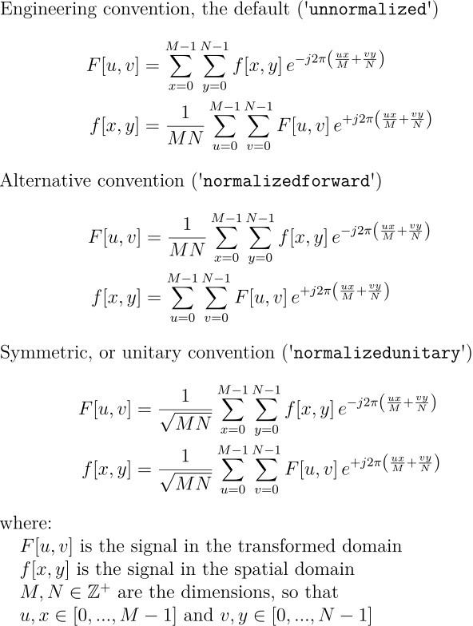

This Node module is an implementation of the two-dimensional Discrete Fourier Transform (2D-DFT), and its inverse, from its very definition. The equations below show the definition of the 2D-DFT and the conventions supported in this module.



# Installation

`npm install dft-2d-fromdefinition`


# Usage

##### Forward transform

```
const dft2ddef = require('dft-2d-fromdefinition');

let signal = [[[1,1],[2,0]],[[4,4],[5,0]]];  // corresponds to the complex signal [[1+j,2],[4+4j,5]]
let transform = dft2ddef.dft(signal, 'unnormalized');
console.log(transform);
// Gives approx. [[[12,5],[-2,5]],[[-6,-3],[0,-3]]]
```

##### Inverse transform

```
const dft2ddef = require('dft-2d-fromdefinition');

let transform = [[[12,5],[-2,5]],[[-6,-3],[0,-3]]];
let signal = dft2ddef.idft(transform, 'unnormalized');
console.log(signal);
// Gives approx. [[[1,1],[2,0]],[[4,4],[5,0]]]  // corresponds to the complex signal [[1+j,2],[4+4j,5]]
```


# Acknowledgements

The project that gave rise to these results received the support of a fellowship from ”la Caixa” Foundation (ID 100010434). The fellowship code is LCF/BQ/DI22/11940036. This work was also supported by FCT through the LASIGE Research Unit (UID/00408/2025).


# License

This work is licensed under CC BY 4.0. See [LICENSE](LICENSE) for more details.